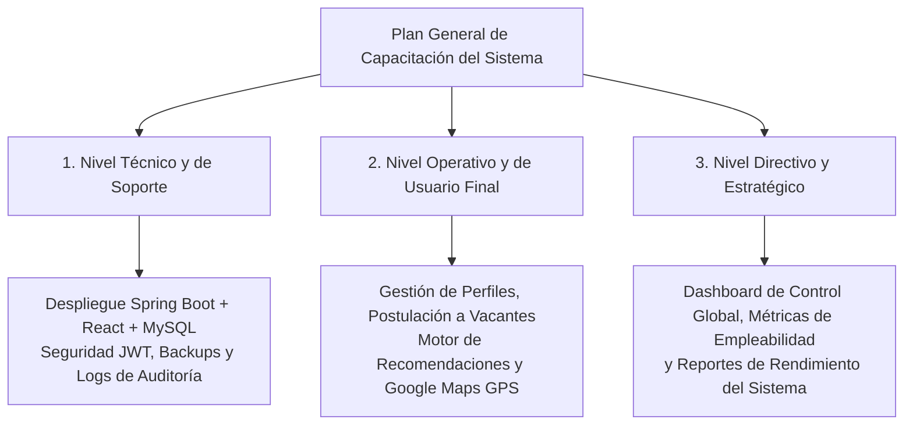
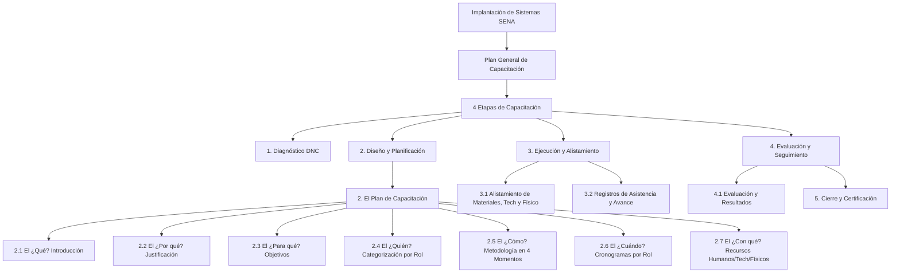
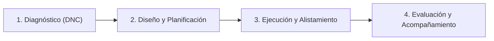
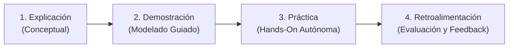
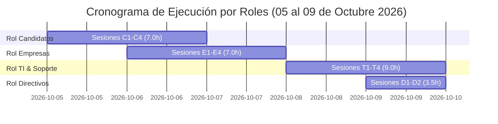

# 🎓 PLAN GENERAL DE CAPACITACIÓN DEL SISTEMA DE INFORMACIÓN
## Servicio Nacional de Aprendizaje — SENA
### FAVA - Formación en Ambientes Virtuales de Aprendizaje
### Proyecto: "Reactivando el Futuro" — Plataforma de Intermediación Laboral

---

### 📋 CONTROL Y FICHA TÉCNICA DEL PLAN

| Campo | Detalle |
| :--- | :--- |
| **Nombre del Software** | Reactivando el Futuro (Plataforma Web de Intermediación Laboral) |
| **Alcance del Plan** | Capacitación General Específica por Roles (Candidatos, Empresas, TI y Directivos) |
| **Fase del Proyecto** | Implantación del Sistema / Puesta en Producción |
| **Entidad / Programa** | SENA - Análisis y Desarrollo de Software (ADSO) |
| **Fecha de Elaboración** | Septiembre 2026 |
| **Período de Ejecución** | Del 05 al 09 de Octubre de 2026 (5 días hábiles / 26.5 horas totales) |
| **Responsables** | Equipo de Desarrollo e Implantación de Software |
| **Público Objetivo** | Candidatos, Empresas Reclutadoras, Administradores de TI, Soporte Técnico y Directivos |
| **Estándar de Referencia** | Guía General de Capacitación e Implantación de Sistemas SENA FAVA |

---

## 📑 ESTRUCTURA DE CONTENIDOS

- [Introducción](#introducción)
- [Mapa de Contenido del Plan](#mapa-de-contenido-del-plan)
- [Niveles de Capacitación General del Sistema](#niveles-de-capacitación-general-del-sistema)
- [1. La Capacitación y su Relación con la Fase de Implantación](#1-la-capacitación-y-su-relación-con-la-fase-de-implantación-del-sistema)
- [Las 4 Etapas de la Capacitación](#las-4-etapas-de-la-capacitación)
- [2. El Plan de Capacitación](#2-el-plan-de-capacitación)
  - [2.1 Introducción (El qué)](#21-introducción-el-qué)
  - [2.2 Justificación (El por qué)](#22-justificación-el-por-qué)
  - [2.3 Objetivos (El para qué)](#23-objetivos-el-para-qué)
  - [2.4 Categorización de Actores y Niveles (El quién)](#24-categorización-de-actores-y-niveles-el-quién)
  - [2.5 Metodología de Enseñanza (Los 4 Momentos Didácticos)](#25-metodología-de-enseñanza-el-cómo)
  - [2.6 Cronograma y Tiempos Detallados por Rol (El cuándo)](#26-cronograma-y-tiempos-detallados-por-rol-el-cuándo)
    - [2.6.1 Cronograma — Rol 1: Candidatos (Aspirantes)](#261-cronograma--rol-1-candidatos-aspirantes)
    - [2.6.2 Cronograma — Rol 2: Empresas Reclutadoras](#262-cronograma--rol-2-empresas-reclutadoras)
    - [2.6.3 Cronograma — Rol 3: Administradores de TI y Soporte Técnico](#263-cronograma--rol-3-administradores-de-ti-y-soporte-técnico)
    - [2.6.4 Cronograma — Rol 4: Coordinadores y Directivos SENA](#264-cronograma--rol-4-coordinadores-y-directivos-sena)
    - [2.6.5 Consolidado General de Tiempos y Plazos](#265-consolidado-general-de-tiempos-y-plazos-del-plan)
  - [2.7 Recursos (El con qué)](#27-recursos-el-con-qué)
- [3. Ejecución de la Capacitación](#3-ejecución-de-la-capacitación)
  - [3.1 Realizar el Alistamiento de la Capacitación](#31-realizar-el-alistamiento-de-la-capacitación)
  - [3.2 Registros y Soporte del Avance](#32-realizar-los-registros-y-llevar-soporte-del-avance)
  - [3.3 Seguimiento del Plan](#33-seguir-el-plan-de-capacitación)
- [4. Evaluar la Capacitación](#4-evaluar-la-capacitación)
  - [4.1 Resultados y Recomendaciones](#41-ejemplo-de-resultados-y-recomendaciones)
- [5. Cierre y Certificación de la Capacitación](#5-cierre-y-certificación-de-la-capacitación)
  - [5.1 Criterios de Participación](#51-criterios-de-participación)
  - [5.2 Verificación del Cumplimiento](#52-verificación-del-cumplimiento)
  - [5.3 Emisión de Constancia / Certificado](#53-emisión-de-constancia--certificado-de-participación)
  - [5.4 Cierre del Ciclo Formativo](#54-cierre-del-ciclo-formativo)
- [Glosario](#glosario)
- [Bibliografía](#bibliografía)
- [Control del Documento](#control-del-documento)

---

## INTRODUCCIÓN

La capacitación en un proyecto de software no se limita exclusivamente a los usuarios finales; abarca de manera integral a **todos los estamentos de la organización** que interactúan con el sistema de información. En el marco del proyecto **"Reactivando el Futuro"**, se establece un **Plan General de Capacitación** diseñado para entrenar al personal técnico (administradores y soporte), al personal operativo (candidatos y empresas reclutadoras) y al personal directivo/estratégico.

Este plan garantiza la adopción tecnológica total del sistema, la continuidad operativa del backend y frontend, el mantenimiento adecuado de la base de datos MySQL y la correcta toma de decisiones basada en métricas y dashboards.

---

## NIVELES DE CAPACITACIÓN GENERAL DEL SISTEMA

Para lograr una implantación exitosa, la formación se divide en tres (3) niveles generales de capacitación:

---

## MAPA DE CONTENIDO DEL PLAN

---

## 1. LA CAPACITACIÓN Y SU RELACIÓN CON LA FASE DE IMPLANTACIÓN DEL SISTEMA

La fase de implantación del sistema de información **"Reactivando el Futuro"** inicia tras superar satisfactoriamente las pruebas de software (unitarias, integradas y de aceptación) y concluye con la puesta en producción del sistema.

Esta fase asegura:
1. La instalación, despliegue y puesta a punto del Backend (Spring Boot), Frontend (React SPA) y Base de Datos (MySQL).
2. La transferencia de conocimiento técnico para la administración de servidores, seguridad JWT y copias de respaldo.
3. La entrega de manuales técnicos y de usuario (impresos y digitales).
4. La capacitación adecuada de todos los perfiles (técnicos, operativos y directivos).

---

## LAS 4 ETAPAS DE LA CAPACITACIÓN

El proceso formativo para la implantación del software **"Reactivando el Futuro"** comprende cuatro (4) etapas metodológicas fundamentales según la guía SENA FAVA:

1. **Etapa 1: Diagnóstico de Necesidades de Capacitación (DNC)**
   - Identificación de las competencias previas y brechas digitales de los perfiles técnicos, operativos y directivos respecto al sistema.
   - Definición de temas críticos de aprendizaje (despliegue técnico, autenticación JWT, geolocalización GPS con Google Maps, motor de recomendaciones y logs de auditoría).

2. **Etapa 2: Diseño y Planificación del Plan de Capacitación**
   - Definición estructurada de contenidos por niveles (Técnico, Operativo, Directivo), metodología B-Learning en 4 momentos, objetivos medibles, cronogramas independientes por rol y asignación de recursos (*Ver Sección 2*).

3. **Etapa 3: Ejecución y Alistamiento de la Capacitación**
   - Alistamiento logístico, tecnológico y físico de los ambientes de aprendizaje, control de asistencia mediante planillas y desarrollo de las sesiones prácticas (*Ver Sección 3*).

4. **Etapa 4: Evaluación y Seguimiento de la Capacitación**
   - Medición del aprendizaje alcanzado mediante encuestas e instrumentos de evaluación (>90% aprobación), análisis de resultados, emisión de certificaciones y plan de soporte post-producción (*Ver Secciones 4 y 5*).

---

## 2. EL PLAN DE CAPACITACIÓN

El plan de capacitación es el documento formal donde se responde detalladamente el **¿Qué?**, **¿Por qué?**, **¿Para qué?**, **¿Quiénes?**, **¿Cómo?**, **¿Cuándo?** y **¿Con qué?** del proceso formativo general.

### 2.1. Introducción (El qué)
En este apartado se establece el programa integral de instrucción sobre el software "Reactivando el Futuro", abordando sus módulos técnicos y funcionales: Despliegue e Infraestructura, Autenticación JWT, Gestión de Perfil de Candidato, Búsqueda de Vacantes, Motor de Recomendaciones (25-25-20-30), Perfil Empresarial con Geolocalización Google Maps y Panel de Administración y Métricas Directivas.

### 2.2. Justificación (El por qué)
Es indispensable realizar la capacitación general para:
- Garantizar la autonomía del equipo técnico en el mantenimiento, resolución de incidencias y gestión de respaldos.
- Reducir la resistencia al cambio y la curva de aprendizaje en candidatos y reclutadores.
- Capacitar a los directivos en la lectura del Dashboard para la toma de decisiones basada en datos de empleabilidad.
- Evitar errores operativos como ofertas con ubicación errónea o fallas en la auditoría del sistema.

### 2.3 Objetivos (El para qué)

> [!TIP]
> **Objetivos Medibles y Alcanzables:**
> 1. **Capacitación Técnica:** Instruir al 100% del personal de TI y soporte en la administración del servidor, seguridad JWT, lectura de logs de auditoría y backups de MySQL.
> 2. **Capacitación Operativa (Empresas):** Entrenar a los encargados de gestión humana en la creación de vacantes con geolocalización GPS y evaluación de candidatos postulados.
> 3. **Capacitación Operativa (Candidatos):** Orientar a los aspirantes en el diligenciamiento del perfil, carga de Hojas de Vida (PDF) y navegación por ofertas recomendadas.
> 4. **Capacitación Directiva:** Capacitar a líderes y directivos en la interpretación del Dashboard de métricas globales y reportes de intermediación laboral.
> 5. **Indicador Global:** Alcanzar una calificación superior al 90% de aprobación en las evaluaciones del proceso formativo.

### 2.4. Categorización de Actores y Niveles (El quién)

Basado en la arquitectura del sistema y la matriz de roles:

| Nivel de Capacitación | Rol / Actor | Módulos / Funcionalidades Asignadas | Perfil del Participante | Competencias TIC Requeridas |
| :--- | :--- | :--- | :--- | :---: |
| **1. Nivel Técnico y Soporte** | **Administradores de TI / Soporte** | Despliegue Backend/Frontend, Gestión DB MySQL, Seguridad JWT, Control de Logs, Bloqueo de Cuentas. | Administradores de TI, DBAs, Soporte Técnico. | Alta / Especializada |
| **2. Nivel Operativo** | **Empresas Reclutadoras** | Perfil Institucional, Geolocalización Google Maps, Gestión de Vacantes (Crear/Editar), Selección de Aspirantes. | Analistas de Selección, Jefes de Gestión Humana. | Media / Alta |
| **2. Nivel Operativo** | **Candidatos / Aspirantes** | Perfil personal, Hoja de Vida (PDF), Búsqueda de Vacantes, Motor de Recomendaciones, Postulaciones. | Buscadores de empleo, jóvenes profesionales, técnicos. | Media / Básica |
| **3. Nivel Directivo** | **Coordinadores / Directivos SENA** | Dashboard de Control Global, Indicadores de Empleabilidad, Trazabilidad General y Reportes Estadísticos. | Líderes de Proyecto, Directivos, Coordinadores. | Media / Ejecutiva |

### 2.5. Metodología de Enseñanza (El cómo)

La capacitación empleará una estrategia mixta (**B-Learning** - Presencial y Virtual) dividida en **4 Momentos Didácticos por Sesión**:

#### Los 4 Momentos Pedagógicos por Sesión:
1. **Momento 1 — Explicación Conceptual:** El facilitador presenta la funcionalidad, el contexto del módulo, las reglas de negocio y el objetivo operativo o técnico.
2. **Momento 2 — Demostración Guiada (Modelado):** El capacitador proyecta la pantalla y realiza el procedimiento paso a paso en el entorno real o de prueba del sistema.
3. **Momento 3 — Práctica Autónoma ("Hands-On"):** Cada participante ejecuta el procedimiento de forma práctica utilizando una cuenta o credencial de prueba asignada (*ej: publicar vacante GPS, postularse a una oferta, realizar backup o consultar logs*).
4. **Momento 4 — Retroalimentación y Evaluación:** El facilitador aclara dudas, verifica el ejercicio práctico y aplica el instrumento de comprobación de conocimientos.

---

### 2.6. Cronograma y Tiempos Detallados por Rol (El cuándo)

Para garantizar una organización óptima, se ha diseñado un cronograma independiente para cada uno de los 4 roles del sistema, especificando módulos, fechas, horarios, duración por sesión, modalidad y facilitador asignado.

#### 2.6.1. Cronograma — Rol 1: Candidatos (Aspirantes)
* **Plazo de ejecución:** 2 Días (05 y 06 de Octubre de 2026)
* **Modalidad:** Virtual Sincrónico (SENA FAVA / Teams)

| Sesión | Tema / Módulo | Fecha | Horario | Duración | Modalidad | Facilitador |
| :---: | :--- | :---: | :---: | :---: | :---: | :--- |
| **C-1** | Introducción al Sistema, Registro y Autenticación JWT | Lun 05-Oct-2026 | 08:00 - 09:30 | 1.5 h | Virtual FAVA | Capacitador FAVA |
| **C-2** | Diligenciamiento de Perfil y Carga de CV en PDF | Lun 05-Oct-2026 | 10:00 - 12:00 | 2.0 h | Virtual FAVA | Capacitador FAVA |
| **C-3** | Búsqueda de Vacantes y Motor de Recomendaciones (Score 25-25-20-30) | Mar 06-Oct-2026 | 08:00 - 10:00 | 2.0 h | Virtual FAVA | Capacitador FAVA |
| **C-4** | Gestor de Postulaciones y Selección de Vacantes Favoritas | Mar 06-Oct-2026 | 10:30 - 12:00 | 1.5 h | Virtual FAVA | Capacitador FAVA |
| **SUBTOTAL**| **Capacitación Rol Candidato** | **2 Días** | — | **7.0 Horas** | — | — |

---

#### 2.6.2. Cronograma — Rol 2: Empresas Reclutadoras (Gestión Humana)
* **Plazo de ejecución:** 2 Días (06 y 07 de Octubre de 2026)
* **Modalidad:** Presencial (Laboratorio de Cómputo SENA) / Híbrida

| Sesión | Tema / Módulo | Fecha | Horario | Duración | Modalidad | Facilitador |
| :---: | :--- | :---: | :---: | :---: | :---: | :--- |
| **E-1** | Registro Institucional y Validación de Cuenta Empresa | Mar 06-Oct-2026 | 14:00 - 15:30 | 1.5 h | Presencial Lab | Ingeniero de Software |
| **E-2** | Creación de Vacantes y Geolocalización GPS en Google Maps API | Mar 06-Oct-2026 | 16:00 - 18:00 | 2.0 h | Presencial Lab | Ingeniero de Software |
| **E-3** | Administración de Vacantes (Editar, Pausar, Cerrar Ofertas) | Mié 07-Oct-2026 | 14:00 - 16:00 | 2.0 h | Presencial Lab | Ingeniero de Software |
| **E-4** | Evaluación de Postulantes, Filtrado y Cambio de Estados de Selección | Mié 07-Oct-2026 | 16:30 - 18:00 | 1.5 h | Presencial Lab | Ingeniero de Software |
| **SUBTOTAL**| **Capacitación Rol Empresa** | **2 Días** | — | **7.0 Horas** | — | — |

---

#### 2.6.3. Cronograma — Rol 3: Administradores de TI y Soporte Técnico
* **Plazo de ejecución:** 2 Días (08 y 09 de Octubre de 2026)
* **Modalidad:** Presencial Especializada (Laboratorio de Infraestructura TI SENA)

| Sesión | Tema / Módulo | Fecha | Horario | Duración | Modalidad | Facilitador |
| :---: | :--- | :---: | :---: | :---: | :---: | :--- |
| **T-1** | Arquitectura y Despliegue Backend (Spring Boot) y Frontend (React SPA) | Jue 08-Oct-2026 | 08:00 - 10:30 | 2.5 h | Presencial Lab TI | Líder de Desarrollo / Arquitecto |
| **T-2** | Administración de BD MySQL, Copias de Respaldo y Scripts | Jue 08-Oct-2026 | 11:00 - 13:00 | 2.0 h | Presencial Lab TI | Administrador DB (DBA) |
| **T-3** | Control de Seguridad JWT, Tokens y Estados de Usuarios (Activo/Bloqueado) | Vie 09-Oct-2026 | 08:00 - 10:30 | 2.5 h | Presencial Lab TI | Especialista en Seguridad |
| **T-4** | Auditoría del Sistema, Lectura de Logs de Eventos e Incidencias | Vie 09-Oct-2026 | 11:00 - 13:00 | 2.0 h | Presencial Lab TI | Líder de Soporte Técnico |
| **SUBTOTAL**| **Capacitación Rol Administrador TI** | **2 Días** | — | **9.0 Horas** | — | — |

---

#### 2.6.4. Cronograma — Rol 4: Coordinadores y Directivos SENA (Estratégico)
* **Plazo de ejecución:** 1 Día (09 de Octubre de 2026)
* **Modalidad:** Híbrida (Sala de Juntas SENA / Webinar Teams)

| Sesión | Tema / Módulo | Fecha | Horario | Duración | Modalidad | Facilitador |
| :---: | :--- | :---: | :---: | :---: | :---: | :--- |
| **D-1** | Introducción a Indicadores y Métricas Globales del Sistema | Vie 09-Oct-2026 | 14:00 - 15:30 | 1.5 h | Híbrida / Teams | Líder de Proyecto |
| **D-2** | Interpretación del Dashboard de Empleabilidad y Reportes Estadísticos | Vie 09-Oct-2026 | 16:00 - 18:00 | 2.0 h | Híbrida / Teams | Líder de Proyecto |
| **SUBTOTAL**| **Capacitación Rol Directivo** | **1 Día** | — | **3.5 Horas** | — | — |

---

#### 2.6.5. Consolidado General de Tiempos y Plazos del Plan

##### Tabla Resumen de Tiempos y Plazos Totales:

| Rol / Público Objetivo | Plazo de Ejecución | Fechas de Calendario | Horas Totales por Rol |
| :--- | :---: | :---: | :---: |
| **1. Candidatos (Aspirantes)** | 2 Días Hábiles | 05 y 06 de Octubre de 2026 | **7.0 Horas** |
| **2. Empresas Reclutadoras** | 2 Días Hábiles | 06 y 07 de Octubre de 2026 | **7.0 Horas** |
| **3. Administradores de TI y Soporte** | 2 Días Hábiles | 08 y 09 de Octubre de 2026 | **9.0 Horas** |
| **4. Coordinadores y Directivos SENA** | 1 Día Hábil | 09 de Octubre de 2026 | **3.5 Horas** |
| **TOTAL GENERAL ACUMULADO** | **5 Días Hábiles** | **Del 05 al 09 de Octubre de 2026** | **26.5 Horas Totales** |

---

### 2.7. Recursos (El con qué)
- **Recursos Humanos:** Líder de proyecto, ingeniero de software/desarrollador, capacitadores FAVA y equipo de soporte.
- **Recursos Tecnológicos:** Equipos de cómputo con navegador moderno, servidores de prueba (Spring Boot + React + MySQL), Google Maps API activada, plataforma Teams/FAVA y videobeam.
- **Recursos Físicos:** Laboratorio de sistemas equipado con escritorios, sillas ergonómicas y red local.
- **Recursos Didácticos:** Manual Técnico, Manual de Usuario, guías rápidas, listas de chequeo e instrumentos de evaluación.

---

## 3. EJECUCIÓN DE LA CAPACITACIÓN

### 3.1. Realizar el Alistamiento de la Capacitación

Formato de verificación de tareas de alistamiento logístico y técnico:

| Tarea de Alistamiento | Observaciones | SI | NO | N/A |
| :--- | :--- | :---: | :---: | :---: |
| **Obtener los permisos necesarios** | Reserva de sala de cómputo / enlace de ambiente FAVA | **X** | | |
| **Organizar los registros de asistencia** | Planilla de firmas física y digital por nivel de capacitación | **X** | | |
| **Reservar el lugar de la capacitación** | Laboratorio de sistemas reservado con 5 días de anticipación | **X** | | |
| **Seleccionar el personal encargado** | Facilitadores e ingenieros designados e instruidos en el software | **X** | | |
| **Identificar los asistentes** | Lista de participantes por nivel (Técnico, Operativo, Directivo) con credenciales | **X** | | |
| **Alistamiento tecnológico** | Servidores backend/frontend corriendo, BD MySQL lista, Google Maps API probada | **X** | | |
| **Preparación de material** | Manual técnico, manual de usuario y diapositivas listos | **X** | | |

#### Recomendaciones de Alistamiento:
a. **Alistamiento de Materiales:** Manual técnico y de usuario, guías rápidas, presentaciones ejecutables y casos de prueba.
b. **Alistamiento Tecnológico:** Equipos configurados, navegador web moderno, servidores de prueba activos, proyector y sonido.
c. **Alistamiento Físico:** Salón iluminado, sillas ergonómicas, tablero y conectores eléctricos.

---

### 3.2. Realizar los Registros y Llevar Soporte del Avance
Durante cada jornada se aplicarán:
1. **Planilla de Asistencia:** Firmada por cada asistente especificando nombre, documento, correo, rol y nivel de capacitación.
2. **Control de Avance:** Formulario de chequeo donde el capacitador registra el cumplimiento de los módulos explicados.

---

### 3.3. Seguir el Plan de Capacitación
- Cumplir el cronograma y horarios estipulados sin interrupciones.
- Guiar la sesión mediante ejercicios prácticos basados en escenarios reales de uso y administración.
- Fomentar la interacción y absolver inquietudes de manera asertiva.

---

## 4. EVALUAR LA CAPACITACIÓN

Al finalizar la capacitación, se aplicará el siguiente instrumento de evaluación para medir la efectividad de las sesiones en todos los niveles:

### Instrumento de Evaluación del Proceso Formativo

| Factor a Evaluar | Cumple | No cumple |
| :--- | :---: | :---: |
| **1. Recursos y Objetivos:** El curso contó con los objetivos y recursos necesarios para el aprendizaje técnico y operativo. | **X** | |
| **2. Cronograma:** Se cumplió el cronograma y horario establecido para la capacitación por nivel. | **X** | |
| **3. Calidad del Material:** El contenido de los manuales (técnico/usuario) y presentaciones fue claro y actualizado. | **X** | |
| **4. Metodología:** La metodología y técnicas aplicadas facilitaron el aprendizaje práctico del software. | **X** | |
| **5. Desempeño del Facilitador:** La información explicada por el facilitador fue clara y respondió las dudas. | **X** | |
| **6. Alistamiento Tecnológico:** El funcionamiento de los computadores y del sistema web fue óptimo durante la sesión. | **X** | |

---

### 4.1. Ejemplo de Resultados y Recomendaciones

Tras la ejecución de la prueba piloto de capacitación se determinó:
- **Actualización Continua:** Se requiere mantener actualizados los manuales técnicos y de usuario ante futuros cambios en el backend o frontend.
- **Soporte Técnico:** Garantizar canales de mesa de ayuda entre desarrollo y TI durante las primeras semanas.
- **Acompañamiento en Producción:** Realizar un periodo de acompañamiento de 2 semanas posteriores a la puesta en producción.
- **Monitoreo de Auditoría:** Utilizar los logs de auditoría del sistema para identificar módulos con posibles dificultades de uso.

---

## 5. CIERRE Y CERTIFICACIÓN DE LA CAPACITACIÓN

Una vez concluidas las sesiones formativas y la evaluación del aprendizaje, se procede al cierre formal del proceso de capacitación.

### 5.1. Criterios de Participación y Aprobación
Para dar por completada satisfactoriamente la capacitación y ser acreedor a la certificación, el participante debe cumplir los siguientes requisitos:
1. **Asistencia:** Registrar asistencia como mínimo al **80%** de las horas programadas para su nivel.
2. **Participación Activa:** Desarrollar los talleres y ejercicios prácticos *"hands-on"* asignados a su rol durante los Momentos 3 y 4.
3. **Evaluación del Aprendizaje:** Lograr una calificación igual o superior al **90%** en la prueba teórica/práctica de conocimiento.
4. **Encuesta de Satisfacción:** Diligenciar el formulario de evaluación de calidad del curso.

### 5.2. Verificación del Cumplimiento
El equipo responsable de implantación verificará los siguientes soportes:
- Planillas de asistencia físicas o digitales debidamente firmadas.
- Lista de chequeo de ejercicios prácticos ejecutados en el sistema de prueba.
- Consolidado de resultados de las pruebas de conocimiento y encuestas de satisfacción.

### 5.3. Emisión de Constancia / Certificado de Participación
A los participantes que cumplan con la totalidad de los criterios se les otorgará una **Constancia Oficial de Participación** respaldada por el SENA y el Equipo de Desarrollo, la cual contendrá:
- **Datos del Participante:** Nombre completo y documento de identidad.
- **Denominación del Curso:** Capacitación General en el uso y administración de la plataforma web *"Reactivando el Futuro"*.
- **Nivel / Rol Acreditado:** Nivel Técnico/Soporte, Nivel Operativo (Candidato/Empresa) o Nivel Directivo.
- **Intensidad Horaria:** Total de horas cursadas (*26.5 horas acumuladas globales o según sesión por rol*).
- **Fecha de Emisión y Firmas:** Fecha formal de aprobación y firma digital/física del Líder de Proyecto y del Instructor SENA.

### 5.4. Cierre del Ciclo Formativo y Plan de Acompañamiento
El cierre formal marca la transición del sistema a producción. Para garantizar una adopción sin contratiempos, se establece un **Plan de Acompañamiento Post-Capacitación** durante las primeras **2 a 4 semanas**, brindando soporte directo para absolver inquietudes en tiempo real y consolidar los conocimientos adquiridos.

---

## GLOSARIO

- **Capacitación General:** Proceso integral de formación, instrucción y entrenamiento a perfiles técnicos, operativos y directivos.
- **Certificación de Capacitación:** Documento o constancia formal que acredita que un participante asistió, participó y aprobó los criterios de conocimiento establecidos en el plan de formación de un software.
- **Constancia de Participación:** Documento probatorio de la realización satisfactoria de una capacitación.
- **Capacitación Técnica:** Formación a administradores de TI y soporte sobre despliegue, seguridad, base de datos y auditoría.
- **Capacitación Operativa:** Formación a usuarios finales para la ejecución de tareas diarias del sistema.
- **Capacitación Directiva:** Formación a líderes y gerentes para la interpretación de métricas e indicadores de gestión.
- **DNC (Diagnóstico de Necesidades):** Proceso sistemático para identificar carencias de competencias antes de una implantación tecnológica.
- **Implantación:** Fase final del desarrollo de software donde se instala, capacita y pone en marcha la aplicación.
- **SENA FAVA:** Formación en Ambientes Virtuales de Aprendizaje del Servicio Nacional de Aprendizaje.
- **JWT (JSON Web Token):** Token de seguridad encriptado para control de acceso al sistema.

---

## BIBLIOGRAFÍA

1. **Servicio Nacional de Aprendizaje - SENA (2026).** *Guía General de Capacitación e Implantación de Sistemas de Información (FAVA)*.
2. **Cabero, A. (2007).** *Tecnología Educativa*. España: McGraw-Hill Interamericana.
3. **Pressman, R. S. (2010).** *Ingeniería del software: un enfoque práctico*. McGraw-Hill.

---

## CONTROL DEL DOCUMENTO

| Rol / Cargo | Nombre y Organización |
| :--- | :--- |
| **Construcción Objeto de Aprendizaje** | Proyecto Reactivando el Futuro - SENA ADSO |
| **Líder de Proyecto / Producción** | Equipo de Desarrollo de Software |
| **Asesores Pedagógicos** | Equipo FAVA - SENA Regional Santander / CIMI |
| **Líderes Temáticos** | Analistas y Desarrolladores de Sistemas de Información |
| **Programación y Formato** | Equipo de Desarrollo Web |
